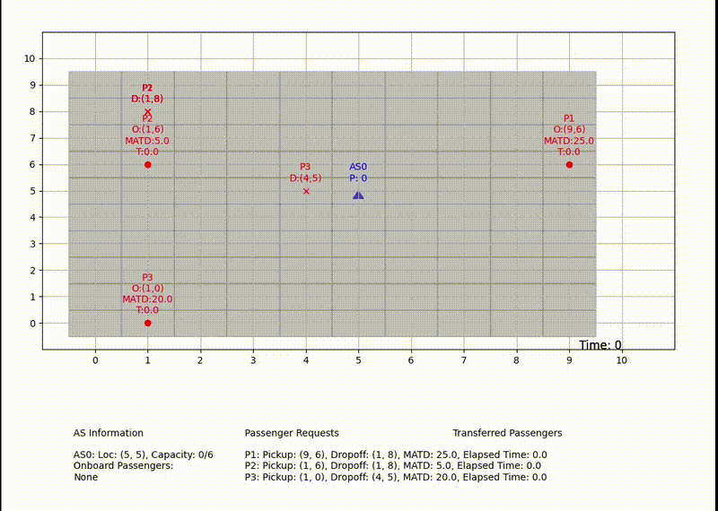
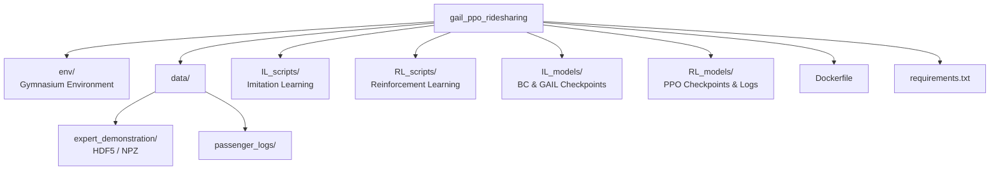

# GAIL–PPO Ride-Sharing Environment

<p align="center">
  
</p>

This repository implements an **end-to-end imitation-to-reinforcement learning pipeline** for autonomous ride-sharing in a custom grid-based shuttle environment. The framework combines **expert demonstration collection**, **Generative Adversarial Imitation Learning (GAIL)**, and **policy refinement via Proximal Policy  Otimization (PPO)**, with quantitative comparison against **Google OR-Tools** baselines.

The project is designed as a **research platform**, not a minimal example, and includes
environment definitions, data generation utilities, Dockerized execution,
trained models, and evaluation scripts.

---

## Learning Pipeline

```mermaid
flowchart TD
    A[Manual Expert Control]
    B[Expert Demonstrations (HDF5 / NPZ)]
    C[GAIL (Adversarial Imitation Learning)]
    D[PPO Fine-Tuning]
    E[Evaluation & Benchmarking (OR-Tools)]

    A --> B --> C --> D --> E
```

The learned policy is first shaped by expert behavior and then optimized to improve
efficiency, generalization, and robustness under stochastic passenger demand.

---

## Environment Overview

- Custom **Gymnasium-compatible** environment (`ShuttleEnv`)
- Grid-based urban layout
- Single or multiple autonomous shuttles
- Dynamic passenger spawning with pickup and drop-off constraints
- Discrete action space (navigation + service actions)
- Supports both headless and visualized execution

The environment is implemented in `env/env_GAIL.py` and is compatible with:

- `stable_baselines3`
- `imitation` (GAIL)
- Vectorized execution (`make_vec_env`)

---

## Repository Structure




---

## Expert Demonstrations

Expert trajectories are collected via a **manual control interface** that allows
human operators to control the shuttle while recording:

- Observations
- Actions
- Rewards
- Next observations
- Episode termination flags

Raw demonstrations are stored as **HDF5 files**, then optionally consolidated into
a single **NPZ dataset** for GAIL training.

This separation preserves:

- Raw trajectory fidelity
- Efficient batch loading for adversarial training

---

## Imitation Learning (GAIL)

GAIL is implemented using the `imitation` library with:

- PPO generator policy (Stable-Baselines3)
- Learned reward network
- Vectorized environments for throughput
- Optional continuation from pretrained checkpoints

Key characteristics:

- Demonstrations treated as state–action transitions
- Variable-length trajectories supported
- Discriminator and policy learning rates decoupled

Training scripts are located in `IL_scripts/`.

---

## Reinforcement Learning (PPO Fine-Tuning)

After imitation, the learned policy is **further optimized using PPO**:

- Improves efficiency beyond expert behavior
- Adapts to stochastic passenger demand
- Encourages exploration while preserving imitation structure

Custom PPO policy architecture includes:

- Feed-forward layers for spatial features
- Optional LSTM for temporal dependencies
- Separate policy and value heads

PPO scripts and policy definitions are in `RL_scripts/`.

---

## Evaluation and Benchmarking

The trained agent can be evaluated using:

- Visual rollout inspection
- Episode-level reward statistics
- Comparison against **Google OR-Tools** routing solutions

Evaluation scripts support:

- Deterministic or stochastic rollouts
- Rendering via Matplotlib
- Side-by-side performance analysis

---

## Docker and Reproducibility

The repository includes a **Dockerfile** that encapsulates:

- Python runtime
- Required ML libraries (PyTorch, SB3, imitation)
- GUI forwarding support for visualization
- GPU acceleration when available

This enables:

- Environment reproducibility
- Cross-machine consistency
- Clean separation from host dependencies

---

## Notes on Included Models and Data

- Trained GAIL and PPO checkpoints are included for reference and evaluation
- Expert demonstrations are provided to enable immediate reproduction
- Large artifacts are intentionally organized to allow selective usage

---

## Intended Use

This repository is intended for:

- Research in imitation learning and reinforcement learning for transportation
- Experimentation with hybrid IL → RL pipelines
- Benchmarking learning-based routing against classical solvers

It is **not** designed as a plug-and-play library, but as a transparent and extensible
research codebase.

---

## License

This project is released under the **MIT License**.  
See the `LICENSE` file for details.
